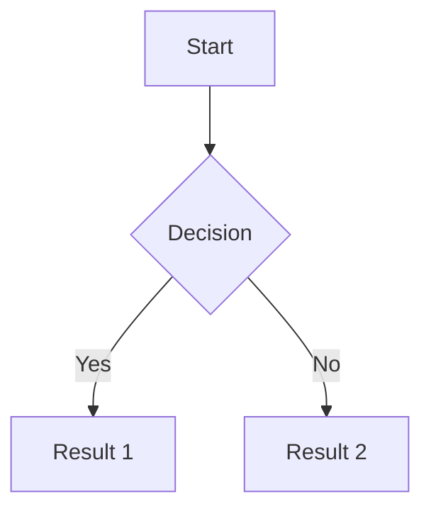

# NoteArea - Modern Markdown Editor

<div align="center">


**Editor Markdown modern dengan fitur lengkap, preview real-time, split view, dan penyimpanan otomatis.**

[](https://reactjs.org/)
[](https://www.typescriptlang.org/)
[](https://vitejs.dev/)
[](https://tailwindcss.com/)
[](https://zustand-demo.pmnd.rs/)

[Demo Live](#) | [Dokumentasi](#fitur-lengkap) | [Laporkan Bug](https://github.com/dwirx/notearea/issues) | [Request Fitur](https://github.com/dwirx/notearea/issues)

</div>

---

## Daftar Isi

- [Tentang Project](#tentang-project)
- [Fitur Lengkap](#fitur-lengkap)
- [Quick Start](#quick-start)
- [Keyboard Shortcuts](#keyboard-shortcuts)
- [Slash Commands](#slash-commands)
- [Tech Stack](#tech-stack)
- [Struktur Project](#struktur-project)
- [Arsitektur](#arsitektur)
- [Deployment](#deployment)
- [Contributing](#contributing)
- [Roadmap](#roadmap)

---

## Tentang Project

**NoteArea** adalah aplikasi web editor Markdown yang powerful dan user-friendly. Dibangun dengan teknologi modern seperti React 18, TypeScript, Vite, dan Zustand untuk state management. Aplikasi ini memberikan pengalaman menulis yang mulus dengan:

- **Preview real-time** dengan sync scroll proporsional
- **Split view** dengan panel yang dapat di-resize
- **Sistem penyimpanan IndexedDB** yang aman dan reliable
- **Dukungan Mermaid diagram** dan **LaTeX/Math**
- **19 tema warna** dan **28 font pilihan**

### Kenapa NoteArea?

| Fitur | Deskripsi |
|-------|-----------|
| **Blazing Fast** | Dibangun dengan Vite untuk performa optimal |
| **IndexedDB Storage** | Penyimpanan aman dengan migrasi otomatis dari localStorage |
| **Split View** | Editor dan preview berdampingan dengan sync scroll |
| **Mermaid & LaTeX** | Dukungan diagram flowchart dan rumus matematika |
| **Beautiful UI** | Interface modern dengan shadcn/ui dan Framer Motion |
| **Fully Responsive** | Desktop, tablet, dan mobile ready |
| **Dark Mode** | Tema gelap/terang dengan system preference |
| **URL Sharing** | Bagikan dokumen via URL dengan kompresi Pako |
| **Virtualized Lists** | Performa optimal dengan react-virtuoso |

---

## Fitur Lengkap

### Mode Tampilan

NoteArea menyediakan 3 mode tampilan yang dapat diganti dengan shortcut:

| Mode | Shortcut | Deskripsi |
|------|----------|-----------|
| **Editor** | `Ctrl/Cmd + 1` | Mode penulisan saja |
| **Preview** | `Ctrl/Cmd + 2` | Mode pratinjau saja |
| **Split** | `Ctrl/Cmd + 3` | Editor dan preview berdampingan |

#### Split View Features

- **Resizable panels** - Drag divider untuk mengatur ukuran panel
- **Sync scroll proporsional** - Scroll sinkron antara editor dan preview
- **Double-click reset** - Double-click divider untuk reset ke 50/50
- **Auto-fallback** - Otomatis switch ke editor mode di layar kecil (<768px)
- **Persistent state** - Ukuran panel tersimpan di localStorage

### Editor Features

<table>
<tr>
<td width="50%">

#### Writing Experience
- **Live Preview** - Lihat hasil markdown secara real-time
- **Auto-save** - Penyimpanan otomatis setiap 1.5 detik
- **Syntax Highlighting** - Support 100+ bahasa pemrograman
- **Slash Commands** - Ketik `/` untuk menu insert cepat
- **Smart Debouncing** - Performa optimal saat mengetik cepat

</td>
<td width="50%">

#### Focus Features
- **Zen Mode** - Mode fokus tanpa gangguan (`Ctrl/Cmd + Shift + Z`)
- **Typewriter Mode** - Kursor selalu di tengah layar
- **Focus Mode** - Highlight paragraf aktif
- **Adjustable Width** - Narrow, Medium, Wide, Full

</td>
</tr>
</table>

### Markdown Support

NoteArea mendukung syntax Markdown lengkap dengan ekstensi tambahan:

#### Standard Markdown

| Feature | Syntax | Output |
|---------|--------|--------|
| **Headers** | `# H1` sampai `###### H6` | Heading 1-6 |
| **Bold** | `**text**` atau `__text__` | **text** |
| **Italic** | `*text*` atau `_text_` | *text* |
| **Strikethrough** | `~~text~~` | ~~text~~ |
| **Code Inline** | `` `code` `` | `code` |
| **Code Block** | ` ```language ` | Syntax highlighted |
| **Checklist** | `- [x]` / `- [ ]` | Interactive checkboxes |
| **Tables** | `\| Header \|` | Aligned tables |
| **Links** | `[text](url)` | Hyperlinks |
| **Images** | `` | Images with lightbox |
| **Blockquotes** | `> quote` | Quoted text |
| **Horizontal Rule** | `---` atau `***` | Divider line |
| **Lists** | `- item` / `1. item` | Bullet/numbered lists |

#### Extended Features

##### Mermaid Diagrams

Buat diagram flowchart, sequence, dan lainnya dengan Mermaid:

````markdown

````

Diagram types yang didukung:
- Flowchart (TD, LR, TB, RL)
- Sequence Diagram
- Class Diagram
- State Diagram
- Entity Relationship Diagram
- Gantt Chart
- Pie Chart
- Git Graph
- Mind Map
- Timeline

##### Math/LaTeX

Tulis rumus matematika dengan LaTeX syntax:

```markdown
Block math:
$$
E = mc^2
$$

Inline math: $x^2 + y^2 = z^2$
```

Contoh rumus yang didukung:
- Fractions: `\frac{a}{b}`
- Square root: `\sqrt{x}`
- Subscript/Superscript: `x_1`, `x^2`
- Greek letters: `\alpha`, `\beta`, `\gamma`
- Summation: `\sum_{i=1}^{n}`
- Integrals: `\int_a^b`
- Matrices: `\begin{pmatrix}...\end{pmatrix}`

### Image Lightbox

Klik gambar untuk melihat dalam mode lightbox:

| Feature | Shortcut | Deskripsi |
|---------|----------|-----------|
| Zoom In | `+` atau `=` | Perbesar gambar (max 3x) |
| Zoom Out | `-` | Perkecil gambar (min 1x) |
| Rotate | `R` | Rotasi 90 derajat |
| Close | `Esc` | Tutup lightbox |
| Touch | Pinch/Swipe | Gesture untuk mobile |

### Document Management

NoteArea menyimpan semua dokumen di IndexedDB dengan fitur:

- **Multi-Document** - Kelola banyak dokumen dalam satu aplikasi
- **Folder Organization** - Atur dokumen dalam folder
- **Tags** - Tambahkan tag untuk kategorisasi
- **Search** - Cari dokumen berdasarkan judul atau konten
- **Virtualized List** - Performa optimal dengan ribuan dokumen
- **Version History** - Lihat dan restore versi sebelumnya
- **Auto-save** - Setiap perubahan tersimpan otomatis
- **Word/Char Count** - Statistik real-time di status bar

### Export & Share

| Format | Fitur | Use Case |
|--------|-------|----------|
| **HTML** | Export dengan styling lengkap | Web, email, printing |
| **Markdown** | Export .md murni | Git, backup, sharing |
| **TXT** | Plain text | Universal compatibility |
| **JSON Backup** | Export semua dokumen | Full backup/restore |
| **QR Code** | Generate QR dari URL | Mobile sharing |
| **URL Hash** | Kompresi Pako otomatis | Instant sharing |

### Search & Replace

Fitur pencarian dan penggantian yang powerful:

| Feature | Deskripsi |
|---------|-----------|
| **Real-time Highlight** | Semua hasil pencarian di-highlight |
| **Current Match** | Match saat ini ditandai dengan warna berbeda |
| **Replace One** | Ganti satu per satu |
| **Replace All** | Ganti semua sekaligus |
| **Case Sensitive** | Toggle pencarian case-sensitive |
| **Whole Word** | Toggle pencarian kata utuh |
| **Regex Support** | Pencarian dengan regular expression |
| **Navigation** | Enter/Shift+Enter untuk next/prev |

### Themes & Customization

#### 19 Color Themes

Light themes: Default, Nord Light, Solarized Light, GitHub Light, One Light
Dark themes: Default Dark, Nord, Solarized Dark, Dracula, Monokai, Tokyo Night, Catppuccin, GitHub Dark, Gruvbox, One Dark, Ayu Dark, Material Dark, Palenight

#### 28 Writer Fonts

**Serif:** Merriweather, Lora, Crimson Pro, Source Serif Pro, Bitter, Libre Baskerville, Playfair Display

**Sans-Serif:** Inter, Open Sans, Nunito, Poppins, Work Sans, DM Sans, Plus Jakarta Sans, Outfit

**Monospace:** JetBrains Mono, Fira Code, Source Code Pro, IBM Plex Mono, Roboto Mono, Ubuntu Mono, Space Mono

**Typewriter:** Special Courier, iA Writer Mono

#### Editor Settings

| Setting | Options | Default |
|---------|---------|---------|
| **Font Size** | 12px - 24px | 16px |
| **Line Height** | 1.4 - 2.2 | 1.75 |
| **Editor Width** | Narrow, Medium, Wide, Full | Medium |
| **Typewriter Mode** | On/Off | Off |
| **Focus Mode** | On/Off | Off |

---

## Quick Start

### Prerequisites

- **Node.js** >= 18.0.0
- **npm** >= 9.0.0 atau **bun** >= 1.0.0

### Installation

```bash
# Clone repository
git clone https://github.com/dwirx/notearea.git

# Masuk ke direktori project
cd notearea

# Install dependencies
npm install
# atau dengan bun
bun install

# Jalankan development server
npm run dev
# Server berjalan di http://localhost:8080
```

### Build Commands

```bash
# Build production
npm run build

# Preview production build
npm run preview

# Build development (dengan debug info)
npm run build:dev

# Lint code
npm run lint
```

---

## Keyboard Shortcuts

### General

| Shortcut | Action |
|----------|--------|
| `Ctrl/Cmd + K` | Command Palette |
| `Ctrl/Cmd + S` | Simpan dokumen |
| `Ctrl/Cmd + N` | Dokumen baru |
| `Ctrl/Cmd + O` | Buka daftar dokumen |
| `Ctrl/Cmd + ,` | Buka pengaturan |
| `Ctrl/Cmd + /` | Bantuan shortcut |

### Navigation

| Shortcut | Action |
|----------|--------|
| `Ctrl/Cmd + F` | Cari & Ganti |
| `Ctrl/Cmd + Shift + T` | Daftar Isi (TOC) |
| `Ctrl/Cmd + Enter` | Buka link (saat kursor di URL) |

### View Modes

| Shortcut | Action |
|----------|--------|
| `Ctrl/Cmd + 1` | Mode Editor |
| `Ctrl/Cmd + 2` | Mode Preview |
| `Ctrl/Cmd + 3` | Mode Split |
| `Ctrl/Cmd + Shift + Z` | Zen Mode |
| `Ctrl/Cmd + Shift + D` | Toggle Dark Mode |

### Text Formatting

| Shortcut | Action | Syntax |
|----------|--------|--------|
| `Ctrl/Cmd + B` | Bold | `**text**` |
| `Ctrl/Cmd + I` | Italic | `*text*` |
| `Ctrl/Cmd + Shift + X` | Strikethrough | `~~text~~` |
| `Ctrl/Cmd + `` ` `` | Inline Code | `` `code` `` |
| `Ctrl/Cmd + Shift + `` ` `` | Code Block | ` ```code``` ` |
| `Ctrl/Cmd + K` | Insert Link | `[text](url)` |

### Headings

| Shortcut | Action |
|----------|--------|
| `Ctrl/Cmd + Alt + 1` | Heading 1 |
| `Ctrl/Cmd + Alt + 2` | Heading 2 |
| `Ctrl/Cmd + Alt + 3` | Heading 3 |
| `Ctrl/Cmd + Alt + 4` | Heading 4 |
| `Ctrl/Cmd + Alt + 5` | Heading 5 |
| `Ctrl/Cmd + Alt + 6` | Heading 6 |

### Lists & Blocks

| Shortcut | Action |
|----------|--------|
| `Ctrl/Cmd + Shift + 8` | Bullet List |
| `Ctrl/Cmd + Shift + 7` | Numbered List |
| `Ctrl/Cmd + Alt + T` | Task List |
| `Ctrl/Cmd + Shift + .` | Blockquote |

### Edit

| Shortcut | Action |
|----------|--------|
| `Ctrl/Cmd + Z` | Undo |
| `Ctrl/Cmd + Shift + Z` | Redo |
| `Ctrl/Cmd + A` | Select All |
| `Tab` | Indent (2 spaces) |
| `Shift + Tab` | Outdent |

---

## Slash Commands

Ketik `/` di editor untuk membuka menu slash command:

| Command | Label | Template |
|---------|-------|----------|
| `/h1` | Heading 1 | `# ` |
| `/h2` | Heading 2 | `## ` |
| `/h3` | Heading 3 | `### ` |
| `/bullet` | Bullet List | `- ` |
| `/number` | Numbered List | `1. ` |
| `/task` | Task List | `- [ ] ` |
| `/code` | Code Block | ` ```\n\n``` ` |
| `/inline` | Inline Code | `` `code` `` |
| `/quote` | Blockquote | `> ` |
| `/table` | Table 3x3 | Table template |
| `/hr` | Divider | `---` |
| `/image` | Image | `` |
| `/link` | Link | `[text](url)` |
| `/mermaid` | Mermaid Diagram | Flowchart template |
| `/math` | Math Block | `$$\nE = mc^2\n$$` |
| `/imath` | Inline Math | `$x^2 + y^2 = z^2$` |

### Navigation di Slash Menu

| Key | Action |
|-----|--------|
| `↑` / `↓` | Navigate options |
| `Enter` / `Tab` | Select option |
| `Esc` | Close menu |
| Type | Filter commands |

---

## Tech Stack

### Core

| Technology | Version | Purpose |
|------------|---------|---------|
| React | 18.3.1 | UI Framework |
| TypeScript | 5.8.3 | Type Safety |
| Vite | 5.4.19 | Build Tool & Dev Server |
| Tailwind CSS | 3.4.17 | Styling Framework |

### State Management

| Library | Version | Purpose |
|---------|---------|---------|
| Zustand | 4.5.5 | Global State Management |
| zustand-mutative | 1.2.0 | Immutable State Updates |
| TanStack Query | 5.83.0 | Server State Management |

### UI & Components

| Library | Version | Purpose |
|---------|---------|---------|
| shadcn/ui | - | High-quality React components |
| Radix UI | - | Accessible primitives |
| Framer Motion | 12.24.12 | Animations & transitions |
| Lucide React | 0.462.0 | SVG icons |
| Sonner | - | Toast notifications |
| react-loading-skeleton | - | Loading states |

### Markdown & Rendering

| Library | Purpose |
|---------|---------|
| Highlight.js | Syntax highlighting (100+ languages) |
| Mermaid | Diagram rendering |
| KaTeX | LaTeX math rendering |

### Utilities

| Library | Version | Purpose |
|---------|---------|---------|
| Pako | 2.1.0 | URL compression |
| qrcode.react | 4.2.0 | QR code generation |
| timeago.js | - | Relative time formatting |
| react-scroll-sync | - | Synchronized scrolling |
| react-virtuoso | - | Virtualized lists |
| date-fns | 3.6.0 | Date utilities |

---

## Struktur Project

```
notearea/
├── public/                      # Static assets
│   ├── og-image.png            # Preview image
│   └── manifest.json           # PWA manifest
├── src/
│   ├── components/             # React components
│   │   ├── ui/                 # shadcn/ui components (30+)
│   │   ├── Editor.tsx          # Basic editor
│   │   ├── LiveEditor.tsx      # Live editing with features
│   │   ├── SplitView.tsx       # Split view with sync scroll
│   │   ├── MarkdownPreview.tsx # Preview renderer
│   │   ├── MermaidViewer.tsx   # Mermaid diagram renderer
│   │   ├── SlashCommandMenu.tsx# Slash command menu
│   │   ├── ImageLightbox.tsx   # Image lightbox
│   │   ├── FloatingMenu.tsx    # Floating action menu
│   │   ├── DocumentsSidebar.tsx# Document management
│   │   ├── SearchReplace.tsx   # Search & replace panel
│   │   ├── KeyboardShortcuts.tsx# Shortcuts help
│   │   ├── VersionHistory.tsx  # Version history panel
│   │   ├── StatusBar.tsx       # Status bar
│   │   ├── Skeletons.tsx       # Loading skeletons
│   │   └── QRModal.tsx         # QR code modal
│   ├── hooks/                  # Custom React hooks
│   │   ├── useDocuments.ts     # Multi-document state
│   │   ├── useDocument.ts      # Single document state
│   │   ├── useSettings.ts      # App settings
│   │   ├── useTheme.ts         # Theme management
│   │   ├── useEditorCommands.ts# Editor commands
│   │   └── use-mobile.tsx      # Mobile detection
│   ├── stores/                 # Zustand stores
│   │   └── editorStore.ts      # Editor UI state
│   ├── lib/                    # Core utilities
│   │   ├── markdown.ts         # Custom markdown parser
│   │   ├── compression.ts      # Pako compression
│   │   ├── storage.ts          # IndexedDB operations
│   │   ├── timeago.ts          # Time formatting (Indonesian)
│   │   └── utils.ts            # General utilities
│   ├── pages/                  # Page components
│   │   ├── Index.tsx           # Main editor page
│   │   └── NotFound.tsx        # 404 page
│   ├── App.tsx                 # App root
│   ├── main.tsx                # Entry point
│   └── index.css               # Global styles & themes
├── CLAUDE.md                   # AI assistant guide
├── README.md                   # Documentation
├── package.json                # Dependencies
├── vite.config.ts              # Vite config
├── tailwind.config.ts          # Tailwind config
├── tsconfig.json               # TypeScript config
└── eslint.config.js            # ESLint rules
```

---

## Arsitektur

### State Management

NoteArea menggunakan Zustand untuk state management dengan struktur:

```
┌─────────────────────────────────────────────────┐
│                  EditorStore                     │
│  (zustand + zustand-mutative + persist)         │
├─────────────────────────────────────────────────┤
│  View State                                      │
│  • viewMode: 'editor' | 'preview' | 'split'     │
│  • isZenMode: boolean                           │
│  • splitPercent: number (25-75)                 │
├─────────────────────────────────────────────────┤
│  UI Panels                                       │
│  • showSidebar, showTOC, showSearch             │
│  • showSettings, showCommandPalette             │
│  • showShortcuts, showVersionHistory, showQR    │
├─────────────────────────────────────────────────┤
│  Editor State                                    │
│  • isEditorFocused, isSaving, lastSaved         │
└─────────────────────────────────────────────────┘
```

### Storage Architecture

Semua data disimpan di IndexedDB dengan struktur:

```
IndexedDB: 'catatan-db' (version 3)
├── documents          # Dokumen markdown
│   ├── id            # UUID
│   ├── content       # Markdown content
│   ├── createdAt     # Timestamp
│   └── updatedAt     # Timestamp
├── folders           # Folder organization
├── tags              # Document tags
└── settings          # App settings
    ├── app-settings  # Theme, font, etc
    └── theme         # Dark/light preference
```

### URL Sharing Flow

```
User Content
    ↓
Pako Deflate Compression
    ↓
Base64 URL-Safe Encoding
    ↓
URL Hash Fragment (#...)
    ↓
Shareable URL
```

### Markdown Parser Flow

```
Input Text
    ↓
┌───────────────────────────────┐
│ 1. Preserve HTML Blocks       │
│ 2. Parse Mermaid Blocks       │
│ 3. Parse Math Blocks          │
│ 4. Parse Code Blocks          │
│ 5. Parse Checklists           │
│ 6. Parse Images (+lightbox)   │
│ 7. Parse Inline Code          │
│ 8. Parse Headers              │
│ 9. Parse Tables               │
│ 10. Parse Text Formatting     │
│ 11. Parse Links & URLs        │
│ 12. Restore HTML Blocks       │
└───────────────────────────────┘
    ↓
Output HTML
```

### Split View Scroll Sync

```
┌─────────────────────────────────────────────────┐
│              ScrollSync Provider                 │
├──────────────────┬──────────────────────────────┤
│  Editor Panel    │  ║  │  Preview Panel         │
│  (ScrollPane)    │  ║  │  (ScrollPane)          │
│                  │  ║  │                        │
│  Proportional    │  ║  │  Proportional          │
│  scroll %        │←─║─→│  scroll %              │
│                  │  ║  │                        │
└──────────────────┴──────────────────────────────┘
         ↑          Resizable Divider
         └── Drag to resize (25%-75%)
```

---

## Deployment

### Vercel (Recommended)

```bash
# Install Vercel CLI
npm i -g vercel

# Deploy
vercel --prod
```

### Netlify

Build command: `npm run build`
Publish directory: `dist`

### Docker

```dockerfile
FROM node:18-alpine AS builder
WORKDIR /app
COPY package*.json ./
RUN npm ci
COPY . .
RUN npm run build

FROM nginx:alpine
COPY --from=builder /app/dist /usr/share/nginx/html
EXPOSE 80
CMD ["nginx", "-g", "daemon off;"]
```

### Static Hosting

```bash
# Build production
npm run build

# Upload folder 'dist' ke hosting
# (GitHub Pages, Cloudflare Pages, dll.)
```

---

## Contributing

### Getting Started

```bash
# Fork repo di GitHub, lalu clone
git clone https://github.com/YOUR_USERNAME/notearea.git
cd notearea

# Install dependencies
npm install

# Create branch
git checkout -b feature/amazing-feature
```

### Commit Convention

| Prefix | Deskripsi |
|--------|-----------|
| `feat:` | Fitur baru |
| `fix:` | Bug fix |
| `docs:` | Update dokumentasi |
| `style:` | Formatting, semicolons, etc |
| `refactor:` | Refactoring code |
| `perf:` | Performance improvement |
| `test:` | Adding tests |
| `chore:` | Dependencies, configs |

### Pull Request

```bash
# Push changes
git push origin feature/amazing-feature

# Create PR di GitHub
```

### Code Style

- TypeScript untuk semua file baru
- Follow existing formatting
- Run `npm run lint` sebelum commit
- Update tests jika perlu
- Update docs jika ada breaking changes

---

## Roadmap

### Completed (v1.x)

- [x] Triple-layer storage (URL + localStorage + IndexedDB)
- [x] Migration ke IndexedDB penuh
- [x] Split view dengan sync scroll
- [x] Resizable split panels
- [x] Mermaid diagram support
- [x] LaTeX/Math support
- [x] Slash commands menu
- [x] Image lightbox dengan zoom/rotate
- [x] Multi-document management
- [x] QR code sharing
- [x] Search & Replace
- [x] 19 color themes
- [x] 28 writer fonts
- [x] Virtualized document list
- [x] Zustand state management
- [x] Version history

### In Progress (v2.0)

- [ ] PWA dengan offline mode
- [ ] Export to PDF
- [ ] Vim keybindings
- [ ] Custom keyboard shortcuts
- [ ] Template gallery
- [ ] Markdown shortcuts cheatsheet

### Planned (v3.0)

- [ ] Real-time collaboration
- [ ] Cloud sync (Google Drive, Dropbox)
- [ ] Plugin system
- [ ] Custom markdown extensions
- [ ] Mobile app (React Native)
- [ ] AI-powered writing assistant

---

## License

MIT License - lihat file [LICENSE](LICENSE) untuk detail.

---

## Acknowledgments

- [shadcn/ui](https://ui.shadcn.com/) - Beautiful UI components
- [Radix UI](https://www.radix-ui.com/) - Accessible primitives
- [Mermaid](https://mermaid.js.org/) - Diagram rendering
- [Highlight.js](https://highlightjs.org/) - Syntax highlighting
- [Framer Motion](https://www.framer.com/motion/) - Animation library
- [Zustand](https://zustand-demo.pmnd.rs/) - State management
- [Lucide](https://lucide.dev/) - Icon set
- [Pako](https://github.com/nodeca/pako) - Compression

---

<div align="center">

**Made with care by [dwirx](https://github.com/dwirx)**

[Report Bug](https://github.com/dwirx/notearea/issues) | [Request Feature](https://github.com/dwirx/notearea/issues) | [Contribute](https://github.com/dwirx/notearea/pulls)

</div>
