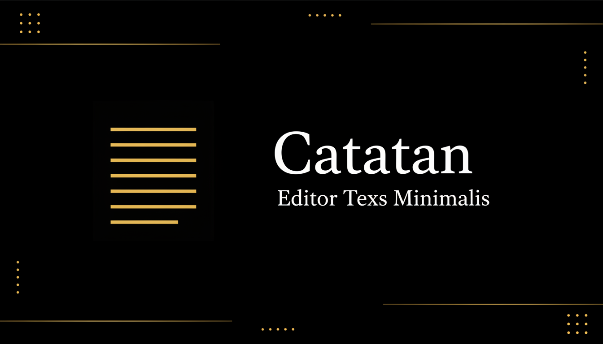

# ✍️ NoteArea - Modern Markdown Editor

<div align="center">



**Editor Markdown modern dengan fitur lengkap, preview real-time, dan penyimpanan otomatis.**

[](https://reactjs.org/)
[](https://www.typescriptlang.org/)
[](https://vitejs.dev/)
[](https://tailwindcss.com/)

[Demo Live](#) • [Dokumentasi](#) • [Laporkan Bug](https://github.com/dwirx/notearea/issues) • [Request Fitur](https://github.com/dwirx/notearea/issues)

</div>

---

## 📖 Tentang Project

**NoteArea** adalah aplikasi web editor Markdown yang powerful dan user-friendly, didesain untuk produktivitas maksimal. Dengan teknologi modern seperti React 18, TypeScript, dan Vite, aplikasi ini memberikan pengalaman menulis yang mulus dengan preview real-time dan sistem penyimpanan triple-layer yang canggih.

### 🎯 Kenapa NoteArea?

- ⚡ **Blazing Fast** - Dibangun dengan Vite untuk performa optimal
- 💾 **Triple-Layer Storage** - URL Hash + localStorage + IndexedDB untuk keamanan data maksimal
- 🎨 **Beautiful UI** - Interface modern dengan shadcn/ui components
- 📱 **Fully Responsive** - Bekerja sempurna di desktop, tablet, dan mobile
- 🌓 **Dark Mode** - Tema gelap/terang dengan dukungan system preference
- 🔗 **URL Sharing** - Bagikan dokumen instant via URL dengan kompresi otomatis

---

## ✨ Fitur Lengkap

### 📝 Editor Features

<table>
<tr>
<td width="50%">

#### ✍️ Writing Experience
- **Live Preview** - Lihat hasil markdown secara real-time
- **Auto-save** - Penyimpanan otomatis setiap 1.5 detik
- **Syntax Highlighting** - Support 100+ bahasa pemrograman
- **Smart Debouncing** - Performa optimal saat mengetik cepat

</td>
<td width="50%">

#### 🔄 Sync & Storage
- **URL Compression** - Kompresi Pako untuk URL sharing
- **IndexedDB** - Backup otomatis di browser
- **localStorage** - Fallback storage
- **Hash Sync** - Real-time URL synchronization

</td>
</tr>
</table>

### 📋 Markdown Support Lengkap

| Feature | Syntax | Keterangan |
|---------|--------|------------|
| **Headers** | `# H1` sampai `###### H6` | 6 level heading |
| **Bold** | `**text**` atau `__text__` | Teks tebal |
| **Italic** | `*text*` atau `_text_` | Teks miring |
| **Strikethrough** | `~~text~~` | Teks dicoret |
| **Code Inline** | `` `code` `` | Kode inline |
| **Code Block** | ` ```language ` | Block kode dengan highlight |
| **Checklist** | `- [x]` / `- [ ]` | Task list interaktif |
| **Tables** | `\| Header \|` | Tabel dengan alignment |
| **Links** | `[text](url)` | Hyperlink |
| **Images** | `` | Gambar dengan lightbox |
| **Blockquotes** | `> quote` | Kutipan |
| **HR** | `---` atau `***` | Garis horizontal |
| **Lists** | `- item` / `1. item` | Ordered & unordered |

### 🖼️ Image Lightbox Premium

- 🔍 **Zoom Controls** - Perbesar gambar 1x sampai 3x
- 🔄 **Rotate** - Rotasi gambar 90° (keyboard: R)
- ⌨️ **Keyboard Navigation** -
  - `Esc` - Tutup lightbox
  - `+` / `=` - Zoom in
  - `-` - Zoom out
  - `R` - Rotate
- 📱 **Touch Gestures** - Swipe dan pinch support

### 📂 Manajemen Dokumen Canggih

- 📄 **Multi-Document** - Kelola banyak dokumen sekaligus
- ✏️ **Rename** - Ubah nama dokumen dengan mudah
- 🗑️ **Delete** - Hapus dokumen dengan konfirmasi
- 💾 **Auto-save** - Setiap dokumen tersimpan otomatis
- 📊 **Stats** - Word count & character count real-time

### 📤 Export & Share

| Format | Fitur | Use Case |
|--------|-------|----------|
| **HTML** | Export dengan styling lengkap | Publikasi web, email |
| **Markdown** | Export .md murni | Backup, Git, sharing |
| **TXT** | Plain text | Universal compatibility |
| **JSON Backup** | Backup semua dokumen | Full data export/import |
| **QR Code** | Generate QR untuk URL | Mobile sharing |

### 🎨 Tema & Customization

- 🌞 **Light Mode** - Tampilan terang untuk siang hari
- 🌙 **Dark Mode** - Tampilan gelap untuk malam hari
- 💻 **System Auto** - Mengikuti preferensi sistem OS
- 🎨 **Custom Themes** - Mudah dikustomisasi via Tailwind

---

## 🚀 Quick Start

### Prerequisites

Pastikan sudah terinstall:
- **Node.js** >= 18.0.0
- **npm** >= 9.0.0 atau **bun** >= 1.0.0

### Instalasi

```bash
# 1. Clone repository
git clone https://github.com/dwirx/notearea.git

# 2. Masuk ke direktori project
cd notearea

# 3. Install dependencies
npm install
# atau gunakan bun untuk instalasi lebih cepat
# bun install

# 4. Jalankan development server
npm run dev
# Server akan berjalan di http://localhost:8080
```

### Build Production

```bash
# Build optimized production bundle
npm run build

# Preview production build
npm run preview

# Build development mode (dengan debug info)
npm run build:dev
```

### Linting

```bash
# Check code quality
npm run lint
```

---

## 🛠️ Tech Stack

### Core Technologies

| Technology | Version | Purpose |
|------------|---------|---------|
| **React** | 18.3.1 | UI Framework |
| **TypeScript** | 5.8.3 | Type Safety |
| **Vite** | 5.4.19 | Build Tool & Dev Server |
| **Tailwind CSS** | 3.4.17 | Styling Framework |

### UI & Components

- **shadcn/ui** - High-quality React components based on Radix UI
- **Framer Motion** (12.24.12) - Smooth animations & transitions
- **Lucide React** (0.462.0) - Beautiful SVG icons
- **Sonner** - Modern toast notifications

### Markdown & Utilities

- **Highlight.js** (11.11.1) - Syntax highlighting untuk 100+ bahasa
- **Pako** (2.1.0) - Zlib compression untuk URL sharing
- **qrcode.react** (4.2.0) - QR code generation
- **date-fns** (3.6.0) - Date utilities

### State & Data Management

- **TanStack Query** (5.83.0) - Server state management
- **React Hook Form** (7.61.1) - Form validation
- **Zod** (3.25.76) - Schema validation

---

## 📁 Struktur Project

```
notearea/
├── public/                      # Static assets
│   ├── og-image.png            # Preview image
│   └── manifest.json           # PWA manifest
├── src/
│   ├── components/             # React components
│   │   ├── ui/                # shadcn/ui components
│   │   │   ├── button.tsx
│   │   │   ├── dialog.tsx
│   │   │   └── ...            # 30+ UI components
│   │   ├── Editor.tsx         # Markdown editor
│   │   ├── LiveEditor.tsx     # Live editing mode
│   │   ├── MarkdownPreview.tsx # Preview renderer
│   │   ├── ImageLightbox.tsx  # Image lightbox
│   │   ├── FloatingMenu.tsx   # Floating action menu
│   │   ├── DocumentsSidebar.tsx # Document management
│   │   ├── StatusBar.tsx      # Status & stats bar
│   │   └── QRModal.tsx        # QR code modal
│   ├── hooks/                 # Custom React hooks
│   │   ├── useDocument.ts     # Single document state
│   │   ├── useDocuments.ts    # Multi-document state
│   │   ├── useTheme.ts        # Theme management
│   │   ├── use-toast.ts       # Toast notifications
│   │   └── use-mobile.tsx     # Mobile detection
│   ├── lib/                   # Core utilities
│   │   ├── markdown.ts        # Custom markdown parser
│   │   ├── compression.ts     # Pako compression utils
│   │   ├── storage.ts         # IndexedDB operations
│   │   └── utils.ts           # General utilities
│   ├── pages/                 # Page components
│   │   ├── Index.tsx          # Main editor page
│   │   └── NotFound.tsx       # 404 page
│   ├── App.tsx                # App root component
│   ├── main.tsx               # Entry point
│   └── index.css              # Global styles
├── CLAUDE.md                   # AI assistant guide
├── README.md                   # Project documentation
├── package.json                # Dependencies
├── vite.config.ts             # Vite configuration
├── tailwind.config.ts         # Tailwind configuration
├── tsconfig.json              # TypeScript config
└── eslint.config.js           # ESLint rules
```

---

## 🎓 Cara Penggunaan

### 1. Menulis Dokumen

```markdown
# Judul Dokumen Saya

## Daftar Tugas
- [x] Setup project
- [x] Install dependencies
- [ ] Deploy to production

## Code Example
\`\`\`javascript
function greet(name) {
  console.log(`Hello, ${name}!`);
}
\`\`\`

## Tabel Data
| Nama | Role | Status |
|------|------|--------|
| Alice | Developer | Active |
| Bob | Designer | Active |
```

### 2. Keyboard Shortcuts

| Shortcut | Action | Context |
|----------|--------|---------|
| `Esc` | Close modal/lightbox | Global |
| `+` / `=` | Zoom in | Image lightbox |
| `-` | Zoom out | Image lightbox |
| `R` | Rotate image | Image lightbox |

### 3. Sharing Dokumen

1. Tulis dokumen Anda
2. URL otomatis ter-update dengan konten terkompresi
3. Copy URL dari browser
4. Atau klik tombol QR untuk generate QR code
5. Share URL/QR ke siapa saja

### 4. Export Dokumen

**Via Floating Menu:**
1. Klik icon menu (⋮)
2. Pilih "Download"
3. Pilih format: HTML, TXT, atau Markdown

**Backup Semua Dokumen:**
1. Klik icon menu
2. Pilih "Export Backup"
3. Download file JSON berisi semua dokumen

---

## 🔧 Configuration

### Environment Variables

Tidak ada environment variables yang diperlukan. Aplikasi berjalan out-of-the-box.

### Customization

#### Mengubah Tema Warna

Edit `src/index.css`:

```css
@layer base {
  :root {
    --primary: 41 85 100;        /* Warna primary */
    --secondary: 210 40% 96.1%;  /* Warna secondary */
    /* ... */
  }
}
```

#### Menambah Language Highlight

Edit `src/lib/markdown.ts`:

```typescript
import hljs from 'highlight.js';
// Import bahasa tambahan
import 'highlight.js/lib/languages/rust';
import 'highlight.js/lib/languages/go';
```

#### Mengubah Auto-save Delay

Edit `src/pages/Index.tsx`:

```typescript
const AUTO_SAVE_DELAY = 1500; // Ubah ke nilai ms yang diinginkan
```

---

## 🏗️ Architecture Deep Dive

### Triple-Layer Storage System

NoteArea menggunakan strategi penyimpanan 3-layer untuk keamanan maksimal:

```
┌─────────────────┐
│   URL Hash      │  Priority 1: Shareable, compressed
│  (Pako deflate) │
└────────┬────────┘
         │ fallback
┌────────▼────────┐
│  localStorage   │  Priority 2: Fast access
│   (Raw text)    │
└────────┬────────┘
         │ fallback
┌────────▼────────┐
│   IndexedDB     │  Priority 3: Reliable storage
│  (Timestamped)  │
└─────────────────┘
```

**Load Priority:** URL Hash → localStorage → IndexedDB
**Save Behavior:** Sync ke semua 3 layer dengan debounce 500ms

### Markdown Parser Flow

```
Input Text
    ↓
Preserve HTML Blocks ─────────┐
    ↓                         │
Parse Code Blocks             │
    ↓                         │
Parse Checklists              │
    ↓                         │
Parse Images (+ lightbox)     │
    ↓                         │
Parse Inline Code             │
    ↓                         │
Parse Headers                 │
    ↓                         │
Parse Tables                  │
    ↓                         │
Parse Text Formatting         │
    ↓                         │
Parse Links & URLs            │
    ↓                         │
Restore HTML Blocks ←─────────┘
    ↓
Output HTML
```

---

## 📦 Deployment

### Vercel (Recommended)

```bash
# Install Vercel CLI
npm i -g vercel

# Deploy
vercel --prod
```

### Netlify

```bash
# Build command
npm run build

# Publish directory
dist
```

### Static Hosting

```bash
# Build production
npm run build

# Upload folder 'dist' ke hosting
# (GitHub Pages, Cloudflare Pages, dll.)
```

---

## 🤝 Contributing

Kontribusi sangat diterima! Berikut cara berkontribusi:

### 1. Fork & Clone

```bash
# Fork repo di GitHub, lalu clone
git clone https://github.com/YOUR_USERNAME/notearea.git
cd notearea
```

### 2. Create Branch

```bash
# Buat branch untuk fitur/fix
git checkout -b feature/amazing-feature
# atau
git checkout -b fix/bug-fix
```

### 3. Commit Changes

```bash
# Stage changes
git add .

# Commit dengan pesan yang jelas
git commit -m "feat: add amazing feature"
# atau
git commit -m "fix: resolve issue #123"
```

**Commit Message Convention:**
- `feat:` - Fitur baru
- `fix:` - Bug fix
- `docs:` - Update dokumentasi
- `style:` - Formatting, missing semicolons, dll
- `refactor:` - Refactoring code
- `test:` - Menambah tests
- `chore:` - Update dependencies, dll

### 4. Push & Pull Request

```bash
# Push ke GitHub
git push origin feature/amazing-feature

# Buat Pull Request di GitHub
```

### Code Style Guidelines

- Gunakan TypeScript untuk semua file baru
- Follow existing code formatting
- Tambahkan comments untuk logic kompleks
- Update tests jika menambah fitur
- Update documentation jika perlu

---

## 🐛 Bug Reports & Feature Requests

Menemukan bug atau punya ide fitur baru?

1. **Cek Issues** - Pastikan belum ada yang report
2. **Create Issue** - Gunakan template yang sesuai
3. **Describe Clearly** - Jelaskan detail bug/fitur
4. **Provide Examples** - Screenshot, code snippet, dll

[Create New Issue](https://github.com/dwirx/notearea/issues/new)

---

## 📄 License

Distributed under the **MIT License**. See `LICENSE` file for more information.

```
MIT License

Copyright (c) 2024 NoteArea

Permission is hereby granted, free of charge, to any person obtaining a copy
of this software and associated documentation files...
```

---

## 🙏 Acknowledgments

Project ini dimungkinkan berkat teknologi dan library open-source yang luar biasa:

- **[shadcn/ui](https://ui.shadcn.com/)** - Beautiful UI components
- **[Radix UI](https://www.radix-ui.com/)** - Unstyled, accessible components
- **[Highlight.js](https://highlightjs.org/)** - Syntax highlighting
- **[Framer Motion](https://www.framer.com/motion/)** - Animation library
- **[Lucide](https://lucide.dev/)** - Icon set
- **[Pako](https://github.com/nodeca/pako)** - Zlib compression
- **[Lovable](https://lovable.dev/)** - Development platform

---

## 📞 Contact & Support

- **GitHub Issues:** [Report Bug](https://github.com/dwirx/notearea/issues)
- **GitHub Discussions:** [Ask Questions](https://github.com/dwirx/notearea/discussions)
- **Email:** [your-email@example.com](mailto:your-email@example.com)

---

## 🗺️ Roadmap

### v2.0 (Coming Soon)
- [ ] PWA Support dengan offline mode
- [ ] Real-time collaboration
- [ ] Cloud sync (Google Drive, Dropbox)
- [ ] Plugin system
- [ ] Custom markdown extensions
- [ ] Export to PDF
- [ ] Mobile app (React Native)

### v1.1 (In Progress)
- [x] Triple-layer storage system
- [x] Image lightbox dengan zoom/rotate
- [x] Multi-document management
- [x] QR code sharing
- [ ] Vim mode untuk editor
- [ ] Custom keybindings
- [ ] Template gallery

---

<div align="center">

**Made with ❤️ by [dwirx](https://github.com/dwirx)**

⭐ Star project ini jika bermanfaat!

[Report Bug](https://github.com/dwirx/notearea/issues) • [Request Feature](https://github.com/dwirx/notearea/issues) • [Contribute](https://github.com/dwirx/notearea/pulls)

</div>
